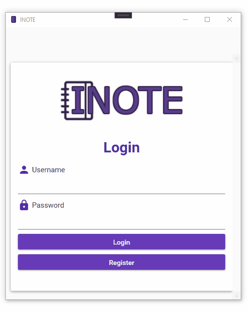

# INOTE


## Description
*INOTE* is a basic note taking application that you can save, update, view or delete your notes. Main purpose of this project is that to show how we can implement and use Model View View Model (**MVVM**) design pattern in WPF Desktop application.

> Technologies & Frameworks
* .Net Framework: 4.8
* Windows Presentation Foundation (WPF) desktop application
* EntityFramework: 6.4.4
* FluentValidation: 9.2.2
* MaterialDesignThemes: 3.2.0
* SQL Server Express Edition: 15.0.2000.5

## Installation

1. Install [SQL Server Express Edition](https://www.microsoft.com/tr-tr/sql-server/sql-server-downloads).
2. Install [SQL Server Management Studio](https://docs.microsoft.com/en-us/sql/ssms/download-sql-server-management-studio-ssms?view=sql-server-ver15).
2. Clone the project into your computer.
3. Open the project and change **ConnectionString** from *App.config* file. You need to change only *data source* value. You can learn your *data source* value from Microsoft SQL Server Management Studio. In Object Explorer panel, you can see your data source name at the start of the tree view.
```xml
<connectionStrings>
      <add name="INoteContext" connectionString="data source=DESKTOP-C05PNM8\SQLEXPRESS;initial catalog=INote;integrated security=True;MultipleActiveResultSets=True;App=EntityFramework" providerName="System.Data.SqlClient" />
    </connectionStrings>
```
4. Finally run the application from Visual Studio.

## Application Overview


